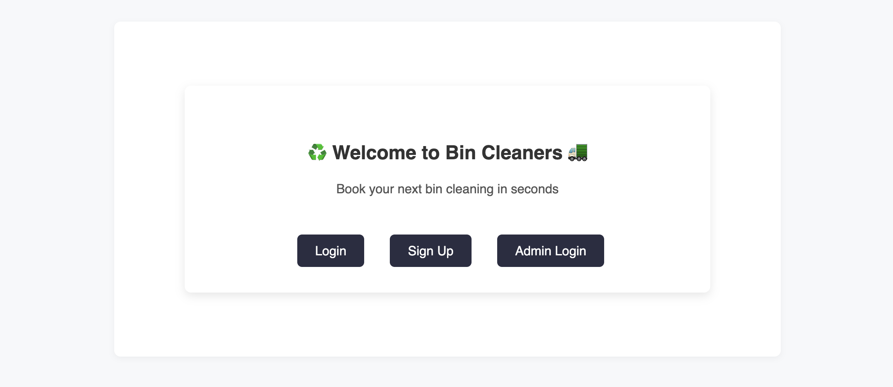

<a name="readme-top"></a>

<!-- PROJECT SHIELDS -->


<br />
<div align="center">
  <a href="https://github.com/calebdh31/bin-cleaners">
    
  </a>

  <h3 align="center">Bin Cleaners</h3>

  <p align="center">
    A simple Django web app for scheduling, managing, and tracking trash and recycling bin cleanings.
    <br />
    <a href="https://github.com/yourusername/bin-cleaners"><strong>Explore the docs »</strong></a>
    <br />
    <br />
    <a href="https://bin-cleaners-demo.onrender.com/">View Demo</a>
    ·
    <a href="https://github.com/yourusername/bin-cleaners/issues">Report Bug</a>
    ·
    <a href="https://github.com/yourusername/bin-cleaners/issues">Request Feature</a>
  </p>
</div>

---

## 📖 About The Project


**Bin Cleaners** is a full-stack Django application that allows users to book, view, edit, and cancel trash and recycling bin cleaning appointments.  
It was built to simulate a small service-based business app with both **user** and **admin** functionality.

### Key Features
- 🔑 User authentication and session management
- 📅 Book a cleaning (date, address, service type)
- ✏️ Edit or cancel existing bookings
- 🧑‍💼 Admin-only dashboard for managing all bookings(django built-in for now)


<p align="right">(<a href="#readme-top">back to top</a>)</p>

---

## 🧭 Built With

- [Python 3](https://www.python.org/)
- [Django 5](https://www.djangoproject.com/)
- [SQLite3](https://www.sqlite.org/index.html)
- [HTML5](https://developer.mozilla.org/en-US/docs/Web/Guide/HTML/HTML5)
- [CSS3](https://developer.mozilla.org/en-US/docs/Web/CSS)
- [Bootstrap-inspired custom styling](https://getbootstrap.com/)
- [Render (Deployment)](https://render.com/)

<p align="right">(<a href="#readme-top">back to top</a>)</p>

## 📈 Roadmap

- ✅ User authentication  
- ✅ CRUD for bookings  
- ✅ Admin dashboard  
- ✅ Conditional access for admin vs users  
- ✅ Responsive UI  
- 🚧 Email notifications for bookings *(coming soon)*  
- 🚧 Payment integration (Stripe) *(planned)*  
- 🚧 Recurring bookings *(planned)*
- 🚧 Employee and Admin fleshed out instances and dashboards *(planned)*  


See the [open issues](https://github.com/yourusername/bin-cleaners/issues) for more ideas and future improvements.

<p align="right">(<a href="#readme-top">back to top</a>)</p>

---

## 🙏 Acknowledgments

Resources and tools that made this project possible:

- [Bootstrap Docs](https://getbootstrap.com/docs/)  
- [Flaticon Icons](https://www.flaticon.com/)  
- [Coolors Palette Generator](https://coolors.co/)  
- [Best README Template](https://github.com/theamazingmrb/Best-README-Template)

<p align="right">(<a href="#readme-top">back to top</a>)</p>


---

## ⚙️ Getting Started

To run this project locally:

### Prerequisites
- Python 3.10+
- pip (Python package manager)
- Virtual environment

### Installation

1. Clone the repo  
   ```bash
   git clone https://github.com/yourusername/bin-cleaners.git
   cd bin-cleaners

# 2. Create and activate a virtual environment
    python3 -m venv venv
    source venv/bin/activate
    
# 3. Install dependencies
    pip install -r requirements.txt

# 4. Apply database migrations
    python manage.py migrate

# 5. Create a superuser (for admin access)
    python manage.py createsuperuser

# 6. Run the development server
    python manage.py runserver

# 7. Open the app in your browser
    http://localhost:8000/

### 🧭 Planning & Resources

**Trello Board**

[View Trello Board](https://trello.com/b/C5abx5Yj/unit-4-project-ga-bin-cleaners)

    

